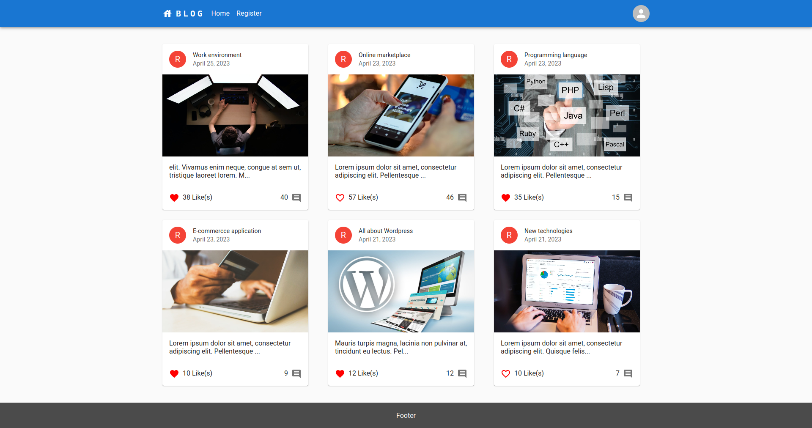
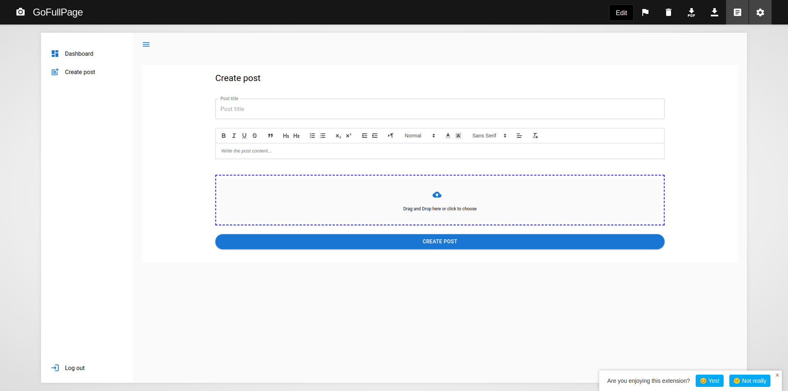

# Fullstack blog with React, Material UI, nodejs, express & mongodb

# Features:
##### - HOC (High Order Component),
##### - Admin & user Dasboard;
##### - React, Material UI, 
##### - Redux, 
##### - Show & hide sidebar,
##### - Notification
##### - Socket io (real time like & unlike post, comment),
##### - Authentication & authorization,
##### - Login & register,
##### - Form validation (Formik & Yup)
##### - Pagination, Datagrid
##### - Responsiveness, etc

